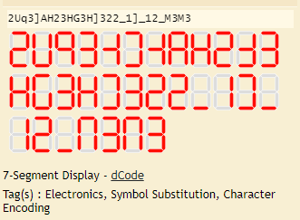
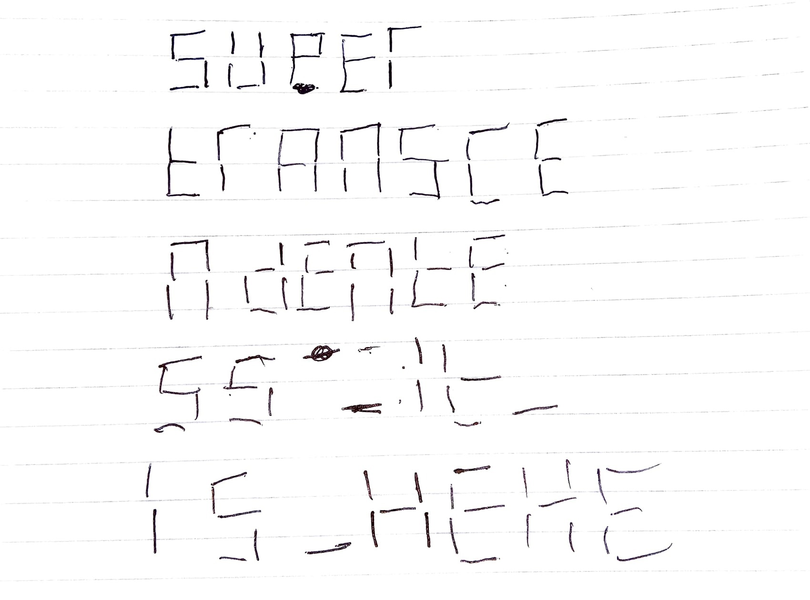

## Cryptography - Help

In this challenge we were given 32 number of 7-bit binary number. I was confused because there is no clue about this challenge. But after and hours, I found something interesting from the challenge's statement which is `display in the office`. <br />

So, I started googling about `display in 7 bit binary` and the result was suprisingly good. <br />
 <br />
I tried to find a tools to help me mapping this binary number into seven segment display and brought me to [this site](https://www.dcode.fr/7-segment-display). The result is not really good because there is some inconsistency between the number and there are some symbols in the result. <br />
. <br />
I tried to find another possibilities such as lower-case display in seven segment but confusing because it is not common. <br />
After quite tired of searching, I tried manually by writing in my book and it is mindblowing as attached below: <br />
 <br />

SO THE FLAG SHOULD BE
```
ARA2023{supertranscendentess_it_is_hehe}
```

