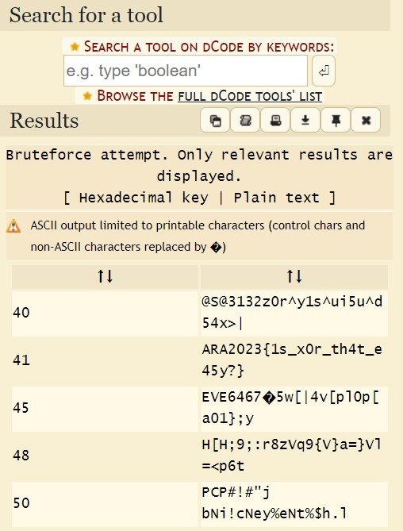

## Cryptography - L0v32x0r

Kita diberikan kode tanpa ada clue tambahan lagi
`"001300737173723a70321e3971331e352975351e247574387e3c"`

tapi melihat judul dari challange nya saya langsung melakukan XOR dan ternyata tidak menemukan flag. lalu saya lakukan bruteforce XOR dan akhirnya menemukan flagnya.

`ARA2023{1s_x0r_th4t_e45y?}`
