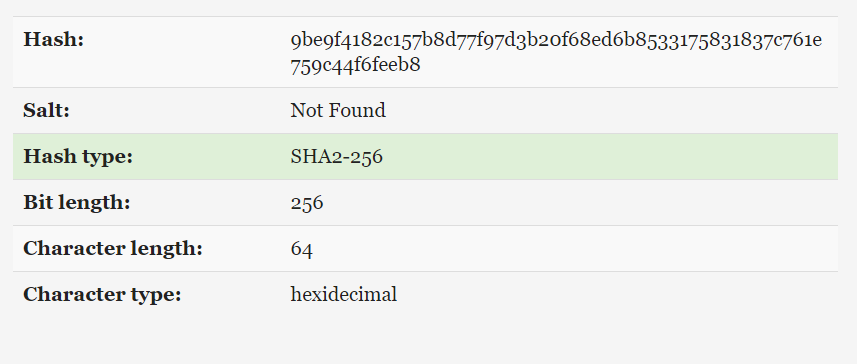
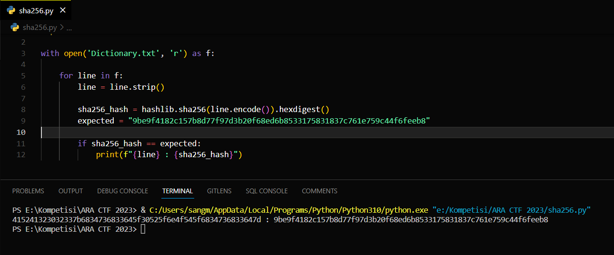

## Cryptography - SH4-32

In this challenge, we were given a hash value as follows.

```
9be9f4182c157b8d77f97d3b20f68ed6b8533175831837c761e759c44f6feeb8
```

Using the hash analyzer from [tunnelsup.com](https://www.tunnelsup.com/hash-analyzer/), we know that this is a SHA2-256 type of hash value.



Also, we were given an attachment named [Dictionary.txt](https://drive.google.com/file/d/1muNug7KzmiHwjx3GCvhrWJzi_tGOugaK/view) that contains many lines of random strings. 

```
123456
123456789
111111
password
qwerty
abc123
12345678
password1
...
...
...
```

As we know, the SHA2-256 type of hash can't be decrypted. So we try to encrypt the all of strings in the `Dictionary.txt` to find which string that have the encrypted string of SHA2-256 that same as the hash provided in the challenge. We use this script.

```py
import hashlib

with open('Dictionary.txt', 'r') as f:

    for line in f:
        line = line.strip()

        sha256_hash = hashlib.sha256(line.encode()).hexdigest()
        expected = "9be9f4182c157b8d77f97d3b20f68ed6b8533175831837c761e759c44f6feeb8"

        if sha256_hash == expected:
            print(f"{line} : {sha256_hash}")
```

We found this string.

```
415241323032337b6834736833645f30525f6e4f545f6834736833647d
```



Try to convert it into hexadecimal, we got the flag. Thanks to [cachesleuth](https://www.cachesleuth.com/multidecoder/).

.png)

</br>

So, this is the flag.

```
ARA2023{h4sh3d_0R_nOT_h4sh3d}
```
