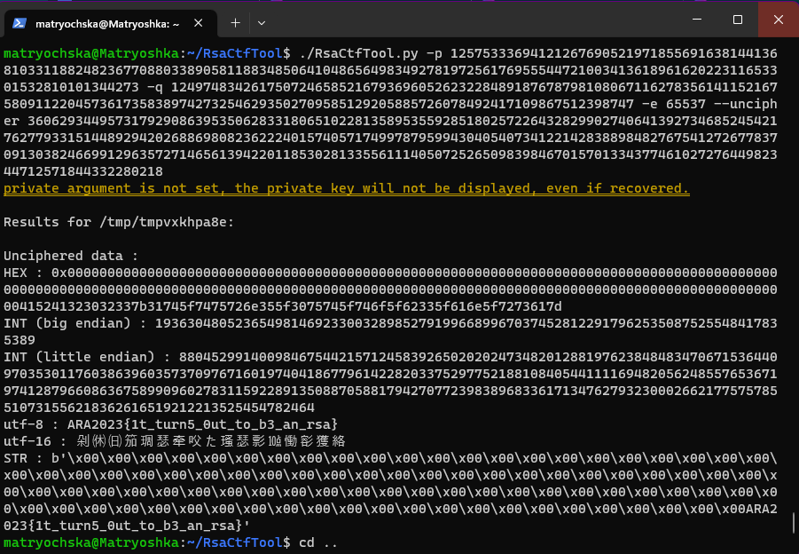

## Cryptography - Secrets Behind a Letter

In this challenge, we were given a Letter attached below:
```
p: 12575333694121267690521971855691638144136810331188248236770880338905811883485064104865649834927819725617695554472100341361896162022311653301532810101344273 
q: 12497483426175072465852167936960526232284891876787981080671162783561411521675809112204573617358389742732546293502709585129205885726078492417109867512398747 
c: 36062934495731792908639535062833180651022813589535592851802572264328299027406413927346852454217627793315144892942026886980823622240157405717499787959943040540734122142838898482767541272677837091303824669912963572714656139422011853028133556111405072526509839846701570133437746102727644982344712571844332280218

e = 65537
```
After doing some research, I can confirmed that this challenge is about RSA so I do searching with a powerful keyword and it brought me to this [stack-overflow discussion](https://stackoverflow.com/questions/49878381/rsa-decryption-using-only-n-e-and-c). <br />

Based on that discussion, the top answer mentioned a tools named `RsaCtfTool` in GitHub so I clone the repository and use it to solve this challenge. <br />

Based of their documentation, I used a command `--uncipher`, here is the result: <br />


So based on this unciphered data, I found that the flag was:
```
ARA2023{it_turn5_0ut_to_b3_ab_rsa}
```
Then here is the result: <br />
