## Forensic - Thinker

Kita diberikan gambar berformat PNG. lalu saya cek di meta data nya dengan membukanya melalui notepad dan menemukan beberpa keanehan.

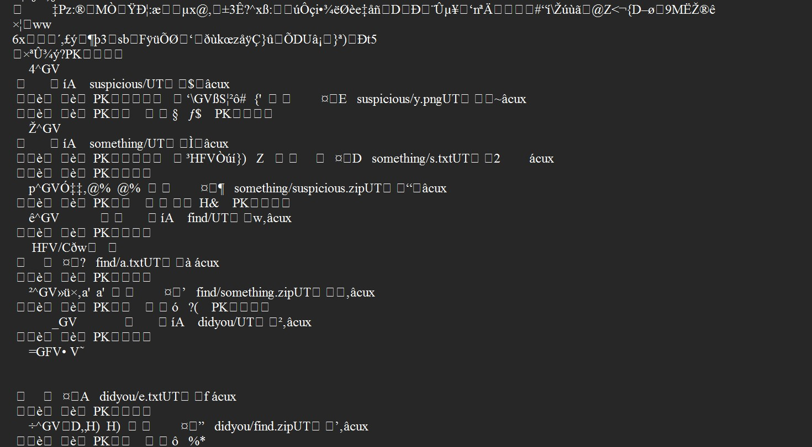

ditemukan ada beberapa file didalam. jadi untuk lebih ditailnya saya cek menggunakan `binwalk` untuk melihat isi dari PNG tersebut.

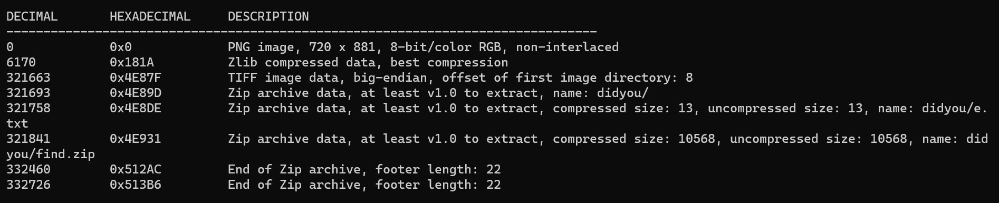

ternyata benar dan ditemukan beberapa file ada dialam PNG tersebut dan di kompres dengan ZIP, lalu selanjutnya saya lakukan extract agar bisa mengakses hidden file tersebut. Hasil dari extract dari file PNG tersebut sebagai berikut.

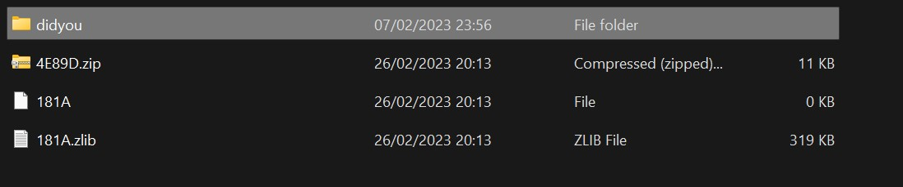

didalam direktori `didyou` ditemukan 2 file yaitu `e.txt` dan `find.zip`

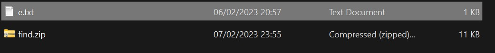

didalam `e.txt` ditemukan kode yang sepertinya kode `base 64` dan coba saya translate. dan benar ternyata itu adalah potongan flag nya.

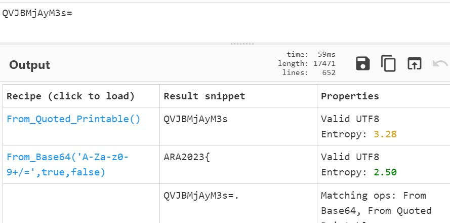

lalu selanjutnya saya coba membuka file `find.zip` nya dan ditemukan file `a.txt` dan `something.zip`.

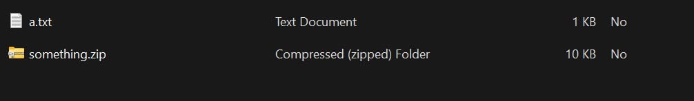

didalam `a.txt` ditemukan kode juga dan saya mencoba translate. Dan ternyata itu adalah potongan flag yang menggunakan kode hex.

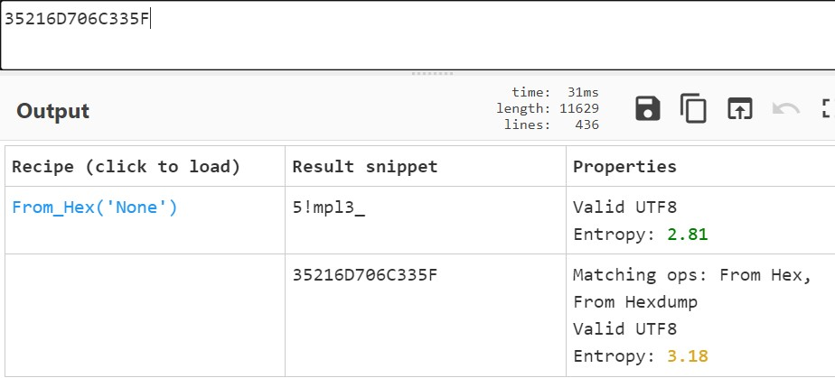

lalu selanjutnya saya mencoba buka file `something.zip` dan menemukan `s.txt` dan `suspicious.zip`.

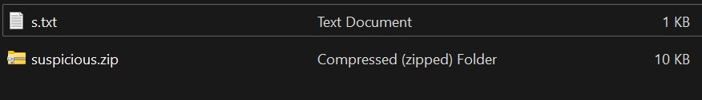

didalam `s.txt` ditemukan kode biner dan saya translate ternyata itu potongan dari flag juga.

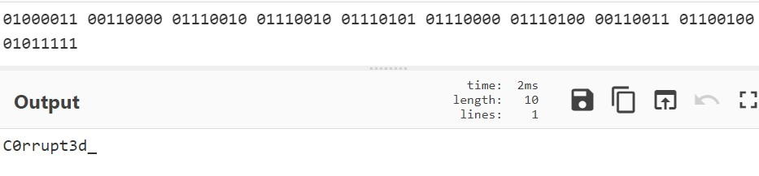

lalu selanjutnya saya buka file `suspicious.zip` nya dan menemukan PNG. namun PNG tersebut tidak dapat dibuka, lalu coba saya lihat menggunakan hex editor dan membandingkannya dengan PNG yang normal ada sebuah keanehan yaitu header file nya berbeda.

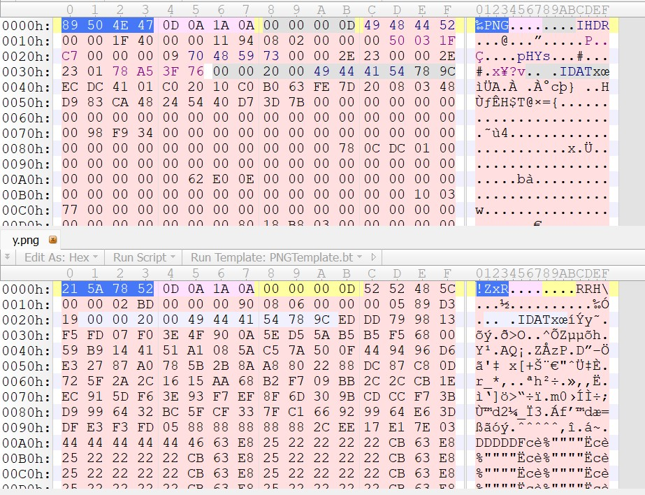

Tetapi IDAT nya ada dan IEND nya pun ada sepertinya hanya ada kesalahan di header nya aja jadi saya ganti headernya dengan punya header PNG lain agar gambar bisa dibuka. Ternyata berhasil tetapi gambar masih tidak memberikan clue.

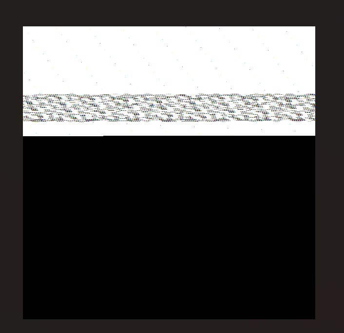

Selanjutnya saya manipulasi untuk width nya karena sepertinya kurang lebar sehingga tak bisa terbaca. jadi saya tambah widhtnya. Tetapi ternyata masih buram dan sulit terbaca maka saya ganti colornya dari truecolor menjadi alphatruecolor

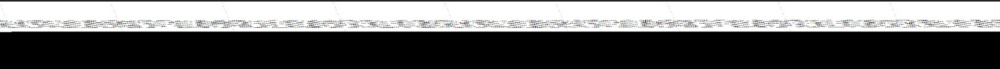
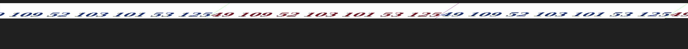

dari gambar tersebut didapatkan deretan angka desimal lalu saya translate. dan akhirnya mendapatkan potongan akhir dari flag nya.

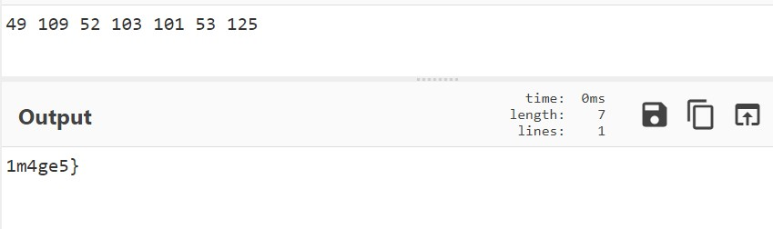

Akhirnya kita telah dapatkan semua flagnya dan tinggal di gabung saja menjadi flag yang utuh

`ARA2023{5!mpl3_C0rrupt3d_1m4ge5}`
