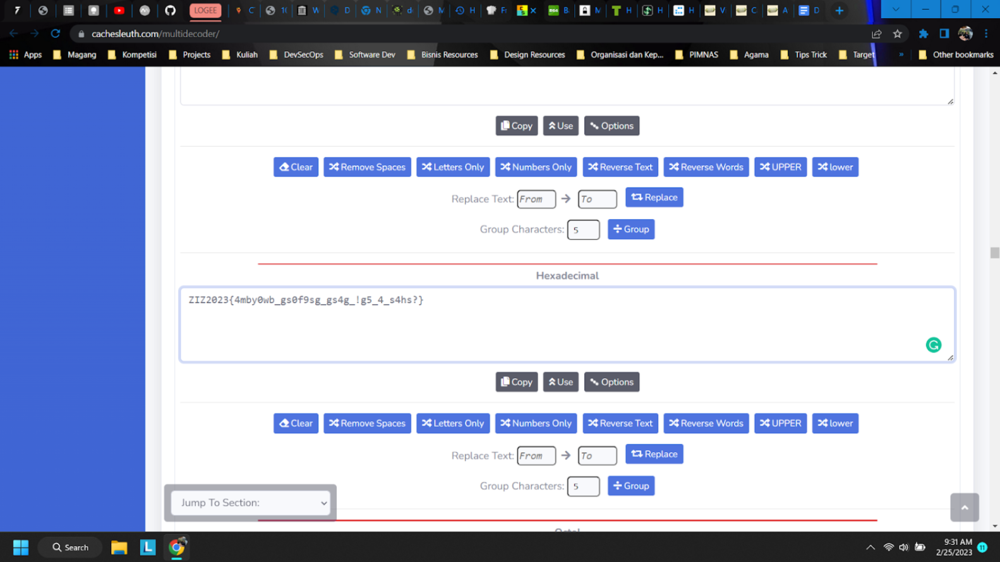
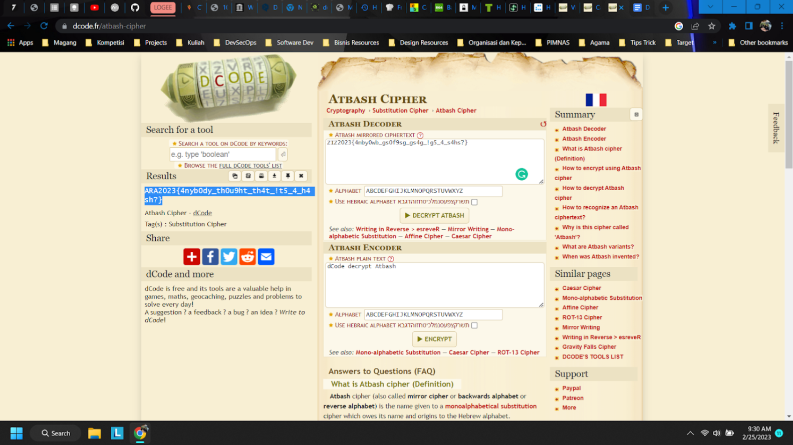

## Misc - @Bash

In this challenge, we were given a string as follows.

```
5A495A323032337B346D62793077625F677330663973675F677334675F2167355F345F733468733F7D
```

So, we use a online multi decoder from [cachesleuth.com](https://www.cachesleuth.com/multidecoder/). We got some suspicious results here in hexadecimal.



Then, we try some decoder to decode the results. After trying some methods, we got it using AtBash chipher decoder. Thanks to [dcode.fr](https://www.dcode.fr/atbash-cipher)



</br>

So, this is the flag.

```
ARA2023{4nyb0dy_th0u9ht_th4t_!t5_4_h4sh?}
```
