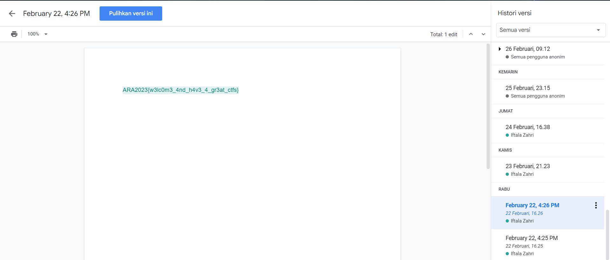

## Misc - in-shanity check

In this challenge, we were given a Google Docs URL [here](https://docs.google.com/document/d/1Jq0AehMiC8Bjkd_Bl7rADQvk6u4ZS8vgFQxIO0SDmi0/edit).

.png)

Nothing to do here. But remember the description that said "Even the flag for sanity check is gone?". What can we do when something currently lost or removed? Yes, we search for its history. So, check the history of this docs, and check for the oldest version of the docs. We got the flag in February 22, 4:26 PM version.



</br>

So, this is the flag.

```
ARA2023{w3lc0m3_4nd_h4v3_4_gr3at_ctfs}
```
