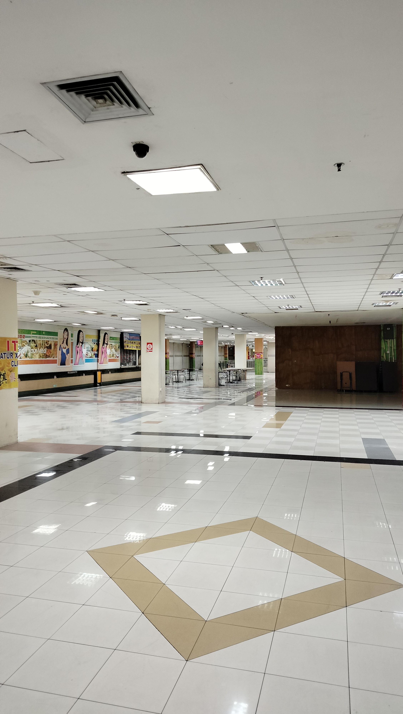
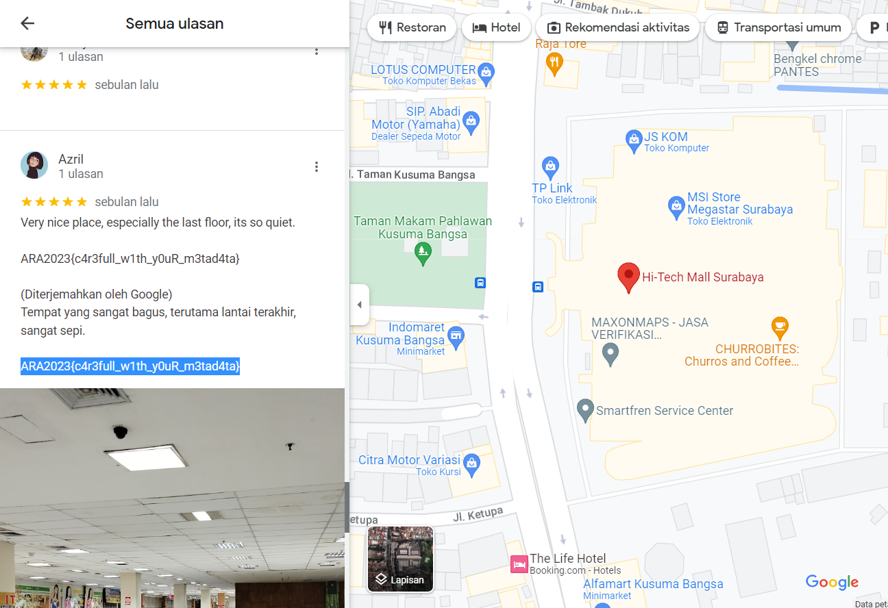

## OSINT - Backroom

In this challenge, we were given an attachment as follows.



Or can be accessed by this [URL](https://drive.google.com/file/d/1ppDfAVephnadJlgSa6sdIKwzJqbOw19B/view).

First time, we try to search it on Google Search by Image. But, we didn't find anything. Then, we try to analyze this image with `exiftool`. Then, we got these information.

```
File Name                       : IMG20221221153220.jpg
Directory                       : .
File Size                       : 2.1 MiB
File Modification Date/Time     : 2023:02:26 20:41:58+07:00
File Access Date/Time           : 2023:02:26 20:45:16+07:00
File Inode Change Date/Time     : 2023:02:26 20:41:58+07:00
File Permissions                : -rwxrwxrwx
File Type                       : JPEG
File Type Extension             : jpg
MIME Type                       : image/jpeg
JFIF Version                    : 1.01
Exif Byte Order                 : Little-endian (Intel, II)
Make                            : realme
Camera Model Name               : realme 9
Orientation                     : Horizontal (normal)
X Resolution                    : 72
Y Resolution                    : 72
Resolution Unit                 : inches
Modify Date                     : 2022:12:21 15:32:20
Y Cb Cr Positioning             : Centered
Interoperability Index          : R98 - DCF basic file (sRGB)
Interoperability Version        : 1.0
Exposure Time                   : 1/50
F Number                        : 1.8
Exposure Program                : Program AE
ISO                             : 1125
Exif Version                    : 0220
Date/Time Original              : 2022:12:21 15:32:20
Create Date                     : 2022:12:21 15:32:20
Offset Time Original            : +07:00
Components Configuration        : Y, Cb, Cr, -
Shutter Speed Value             : 1/50
Aperture Value                  : 1.7
Brightness Value                : 42949671.79
Exposure Compensation           : 0
Max Aperture Value              : 1.7
Metering Mode                   : Center-weighted average
Flash                           : Off, Did not fire
Focal Length                    : 5.2 mm
Maker Note Unknown Text         : (Binary data 147 bytes, use -b option to extract)
Warning                         : Invalid EXIF text encoding for UserComment
User Comment                    : oplus_32
Sub Sec Time                    : 831
Sub Sec Time Original           : 831
Sub Sec Time Digitized          : 831
Flashpix Version                : 0100
Color Space                     : sRGB
Exif Image Width                : 0
Exif Image Height               : 0
Sensing Method                  : Not defined
Scene Type                      : Directly photographed
Exposure Mode                   : Auto
White Balance                   : Auto
Focal Length In 35mm Format     : 24 mm
Scene Capture Type              : Standard
GPS Version ID                  : 2.2.0.0
GPS Time Stamp                  : 08:32:20
GPS Map Datum                   : WGS-84
GPS Date Stamp                  : 2022:12:21
XMP Toolkit                     : Image::ExifTool 10.96
Date/Time Digitized             : 2022:12:21 15:32:20+07:00
Date Created                    : 2022:12:21 15:32:20.831+07:00
Profile CMM Type                : Apple Computer Inc.
Profile Version                 : 4.0.0
Profile Class                   : Display Device Profile
Color Space Data                : RGB
Profile Connection Space        : XYZ
Profile Date Time               : 2018:06:24 13:22:32
Profile File Signature          : acsp
Primary Platform                : Apple Computer Inc.
CMM Flags                       : Not Embedded, Independent
Device Manufacturer             : Unknown (OPPO)
Device Model                    :
Device Attributes               : Reflective, Glossy, Positive, Color
Rendering Intent                : Perceptual
Connection Space Illuminant     : 0.9642 1 0.82491
Profile Creator                 : Apple Computer Inc.
Profile ID                      : 0
Profile Description             : Display P3
Profile Copyright               : Copyright Apple Inc., 2017
Media White Point               : 0.95045 1 1.08905
Red Matrix Column               : 0.51512 0.2412 -0.00105
Green Matrix Column             : 0.29198 0.69225 0.04189
Blue Matrix Column              : 0.1571 0.06657 0.78407
Red Tone Reproduction Curve     : (Binary data 32 bytes, use -b option to extract)
Chromatic Adaptation            : 1.04788 0.02292 -0.0502 0.02959 0.99048 -0.01706 -0.00923 0.01508 0.75168
Blue Tone Reproduction Curve    : (Binary data 32 bytes, use -b option to extract)
Green Tone Reproduction Curve   : (Binary data 32 bytes, use -b option to extract)
Image Width                     : 2256
Image Height                    : 4000
Encoding Process                : Baseline DCT, Huffman coding
Bits Per Sample                 : 8
Color Components                : 3
Y Cb Cr Sub Sampling            : YCbCr4:2:0 (2 2)
Aperture                        : 1.8
Image Size                      : 2256x4000
Megapixels                      : 9.0
Scale Factor To 35 mm Equivalent: 4.6
Shutter Speed                   : 1/50
Create Date                     : 2022:12:21 15:32:20.831
Date/Time Original              : 2022:12:21 15:32:20.831+07:00
Modify Date                     : 2022:12:21 15:32:20.831
GPS Date/Time                   : 2022:12:21 08:32:20Z
GPS Latitude                    : 7 deg 15' 9.97" S
GPS Longitude                   : 112 deg 45' 2.06" E
GPS Latitude Ref                : South
GPS Longitude Ref               : East
Circle Of Confusion             : 0.007 mm
Field Of View                   : 73.7 deg
Focal Length                    : 5.2 mm (35 mm equivalent: 24.0 mm)
GPS Position                    : 7 deg 15' 9.97" S, 112 deg 45' 2.06" E
Hyperfocal Distance             : 2.39 m
Light Value                     : 3.8
```

It feels so clueless until we read the description of the challenge again. 

> I found a place that give me a backroom vibes. I think I like this place, so I give this place 5 star. Can you find this place?

it seemed to highlighted the word 'place'. So, based on the data file given by the `exiftool`. We try to 'find' the place with the GPS latitude and longitude data. 

```
GPS Latitude                    : 7 deg 15' 9.97" S
GPS Longitude                   : 112 deg 45' 2.06" E
```

Use the Google Maps, so, we need to convert it into this form.

```
7°15'9.97"S
112°45'2.06"E
```
Open the Google Maps, input the latitude and longitude data into search bar with `longitude latitude` format.

.png)

When we see, there is several place that pinned here. As the description challenge said, "so I give this place 5 star". Try to search one by one from these places the 5 stars review (sort by latest and highest rating). Then, we got it in Hi-Tech Mall Surabaya as follows.




</br>

So, this is the flag.

```
ARA2023{c4r3full_w1th_y0uR_m3tad4ta}
```
