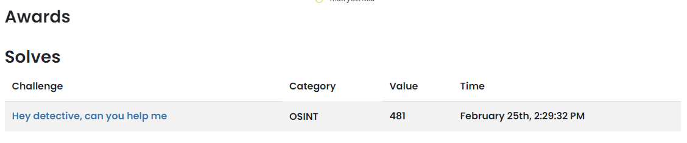

## OSINT - Hey detective, can you help me

In this challenge we are given information to find a cosplayer from China who like to post their photos on Facebook and Instagram. There were several instructions given, first I tried to find cosplayer who had collaborated with Sakura (also from china). <br /> <br />
On instagram I found a cosplayer account named Sakura with the username sakura.gun. Here is the profile [sakura.gun on instagram](https://www.instagram.com/sakura.gun/) and looked for accounts that had collaborated with her.
1. First, i found a cosplayer named rakuko but it didn't match the next clue which is **studying in top university in China** because rakuko herself was studying abroad in America.
2. Second, i found another collaboration with account named skylaryuuu, but I thought it was not her that I tried to search because skylaryuuu currently move to Canada.
3. Third, i found an ordinary photo (not doing cosplay) with an account named Yanzikenko. I am interested with this account so I tried to find her page in Facebook. <br />

It turned out that what I did was right because I found several matching photos with the clues given in the challenge. Here is [her facebook page](https://www.facebook.com/yanzikenko.hii/). <br />

Based on her photo in Facebook, I tried to follow the instructions as below:
1. Social Media ID
   Based on the Flag format, it should be an Instagram ID so i use this [Find Instagram User ID Tools](https://commentpicker.com/instagram-user-id.php). <br />
   And the value was `44793134117`
2. Her university but in abbreviation.
   So, based on [this photo](https://www.facebook.com/yanzikenko.hii/photos/pb.100050373615054.-2207520000./981433412286852/?type=3&locale=id_ID), he graduated from Beijing Normal University. So the second flag pattern should be `BNU`.
3. Mascot name where she was in the doll shop.
   There is a post that should include [her photo](https://www.facebook.com/yanzikenko.hii/photos/pb.100050373615054.-2207520000./859835367779991/?type=3&locale=id_ID) with a mascot in the doll store She took a picture with a mascott named `Molly` from PopMart.
4. Date and Time when she posted a photo in the bookstore.
   Previously, an instruction mentioned that she was photographed sitting in a bookstore. So, there are two different post which have a photo that it is could be taken in the bookstore. <br />
   [First post](https://web.facebook.com/yanzikenko.hii/posts/pfbid0uG8BFbCp2jwKtpTkqJzD5H8yJHvaC5UYYqBRZdzKqcqdggb37ABU3bLfeczudEHml) and the [second post](https://web.facebook.com/yanzikenko.hii/posts/pfbid026jS3JF3qf1pVeiF8CuqHa8nsxC6oFc4hvAycr57MxGjmiQXdGqdPHQsxENJHUfGDl?_rdc=1&_rdr). <br />
   So it could be `3Juni2019-10:25` or `14Februari2019-14:59`.
5. The last part, which is the most challenging part is to find redacted flag. There are so many photo which have Kenko and Sakura collaborated. So after an hours read, I found a powerful comments attached below:
   

AND FINALLY AFTER TRYING SEVERAL POSSIBILITIES, I FOUND THAT THE FLAG WAS:
```
ARA2023{44793134117_BNU_Molly_3Juni2019-10:25_Y0u4r3ThE0s1nTm45t3R}
```
and this is the result:
