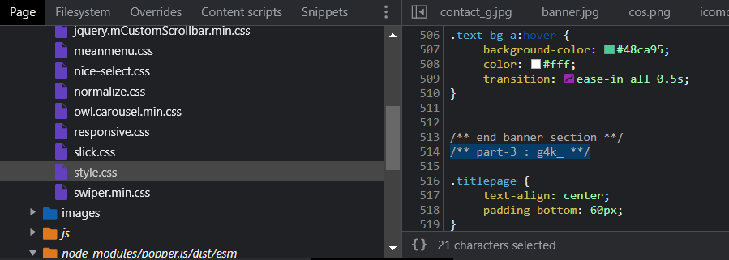
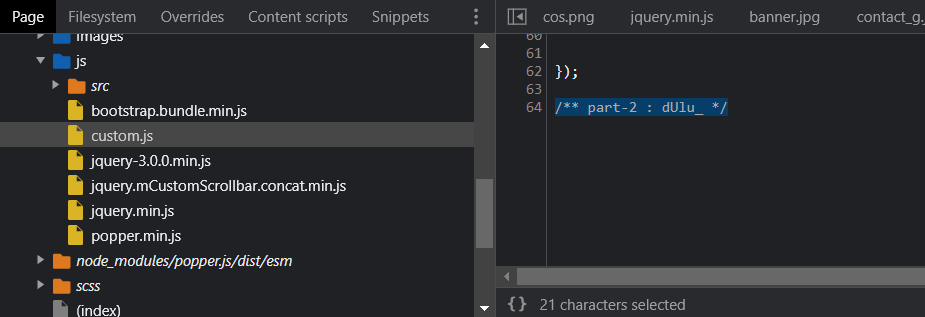
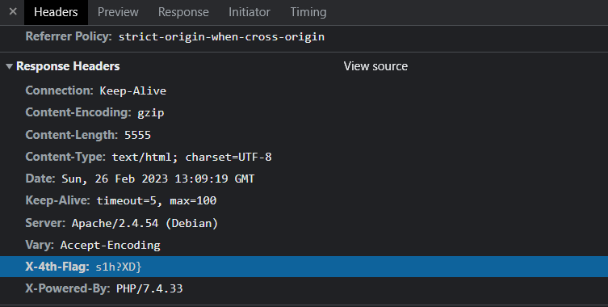

## Web Exploitation - Dewaweb

In this challenge, we were given an IP Address of a website.

.png)

Our approach was checking the sources of the website. First, we checked the HTML source of the given website. It gives us the first part of the flag here.


```
part-1 : ARA2023{s4nt4I_
```

Next, we try to check the CSS sources of the website. It gives us the third part of the flag instead of the second part. It located in `/css/style.css`.



```
part-3 : g4k_
```

Then, we check the JS sources of the website. It gives us the second part of the flag here. It located in `/js/custom.js`.



```
part-2 : dUlu_
```

The last part, we got it in response header.



```
X-4th-Flag: s1h?XD}
```

</br>

So, when all of part were arranged, it will be full flag.

```
ARA2023{s4nt4I_dUlu_g4k_s1h?XD}
```
