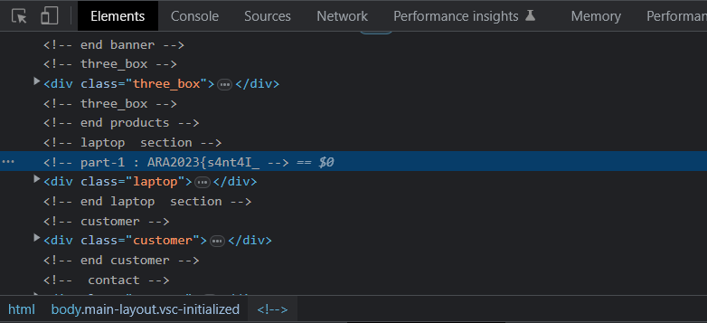

## Web Exploitation - Dewaweb

In this challenge, we were given an IP Address of a website.

.png)

Our approach was checking the sources of the website. First, we checked the HTML source of the given website. It gives us the first part of the flag here.



```

```


So based on this unciphered data, I found that the flag was:
```
```
