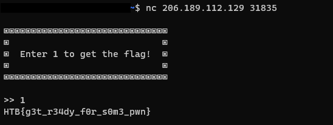

## PWN - Initialise Connection

### Description
> 300pts
> 
> In order to proceed, we need to start with the basics. Start an instance, connect to it via $ nc e.g. nc 127.0.0.1 1337 and send "1" to get the flag.

### Knowledge Requirements

1. Connect to server using `nc` command
2. Basic understanding of shell input

### Exploit

This challenge was an introduction to connect command-line utility for reading and writing data between two computer networks (read [here](https://phoenixnap.com/kb/nc-command#:~:text=The%20Netcat%20(%20nc%20)%20command%20is,%2C%20ncat%20%2C%20and%20others)).

Let's connect to instance using `nc 206.189.112.129 31835` and we got the flag by enter `1`. 


So the flag was:
```
HTB{g3t_r34dy_f0r_s0m3_pwn}
```