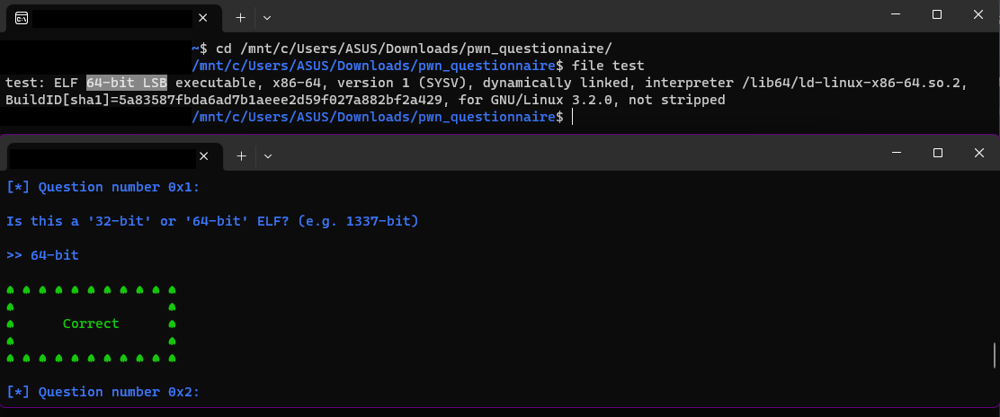
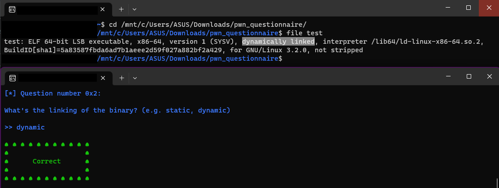
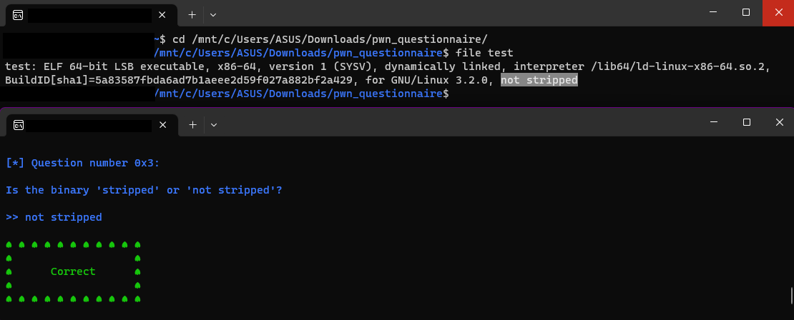
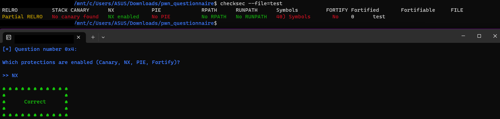
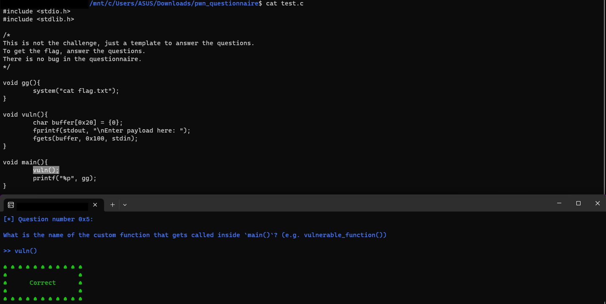
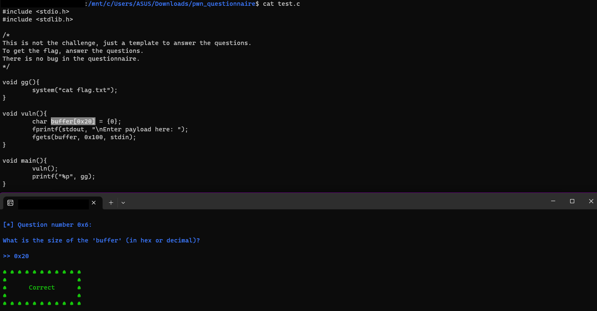
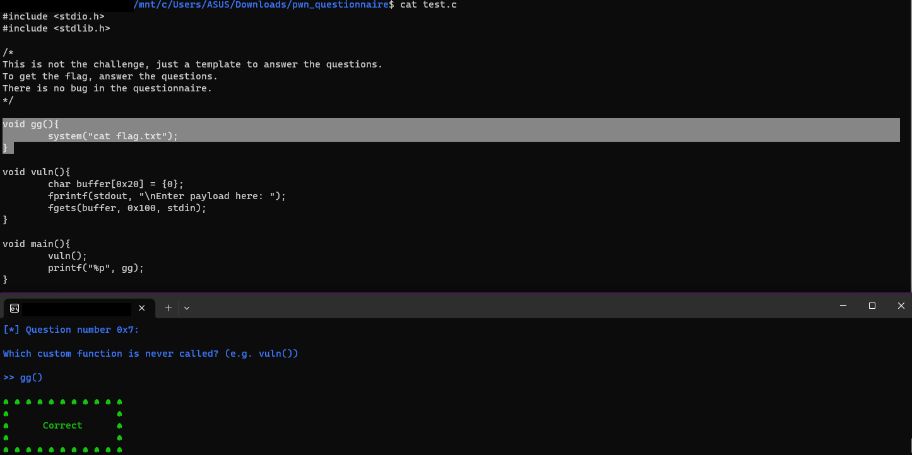
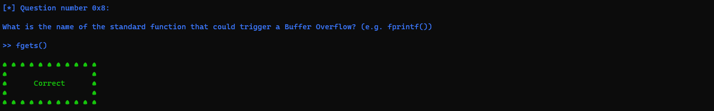
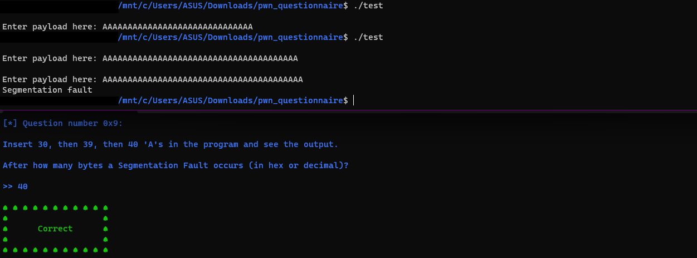
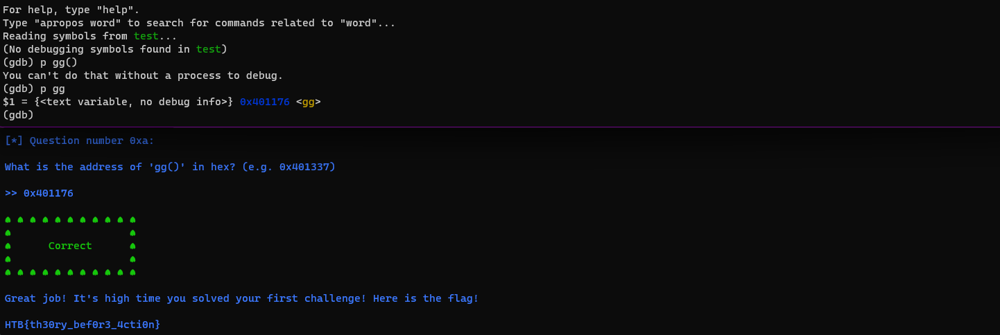

## PWN - Qustionnaire

### Description

> 300pts
> 
> It's time to learn some things about binaries and basic c. Connect to a remote server and answer some questions to get the flag.

### Knowledge Requirements

1. Basic understanding of C programming language
2. Using gdb to debug program

### Exploit

In this challenge we were given a connection so let's connect using nc command. After that we were given several question to answer. 

```
[*] Question number 0x1:

Is this a '32-bit' or '64-bit' ELF? (e.g. 1337-bit)
```

To answer this question, I use the `file` command to the `test` file.



Next,

```
[*] Question number 0x2:

What's the linking of the binary? (e.g. static, dynamic)
```



```
[*] Question number 0x3:

Is the binary 'stripped' or 'not stripped'?
```



```
[*] Question number 0x4:

Which protections are enabled (Canary, NX, PIE, Fortify)?
```

To answer this question, I used the `checksec` command.



```
[*] Question number 0x5:

What is the name of the custom function that gets called inside `main()`? (e.g. vulnerable_function())
```



```
[*] Question number 0x6:

What is the size of the 'buffer' (in hex or decimal)?
```



```
[*] Question number 0x7:

Which custom function is never called? (e.g. vuln())
```



```
[*] Question number 0x8:

What is the name of the standard function that could trigger a Buffer Overflow? (e.g. fprintf())
```



`fgets()` function can trigger Buffer Overflow because user can input value over the size of the buffer. Read [this.](https://iq.opengenus.org/gets-vs-fgets-in-c/#:~:text=depends%20on%20system-,gets()%20keeps%20reading%20input%20until%20newline%20character%20or%20end,of%20input%20characters%20is%20reached.)

```
[*] Question number 0x9:

Insert 30, then 39, then 40 'A's in the program and see the output.
```



The last question was
```
[*] Question number 0xa:

What is the address of 'gg()' in hex? (e.g. 0x401337)
```
To answer ths question, I used gdb and enter `p <function_name>`. The result was:



After answering all of the question, we were given the flag
```
HTB{th30ry_bef0r3_4cti0n}
```