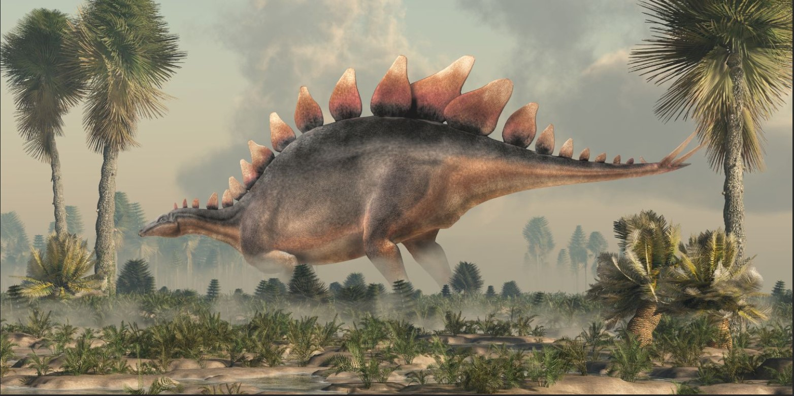
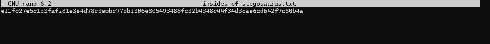
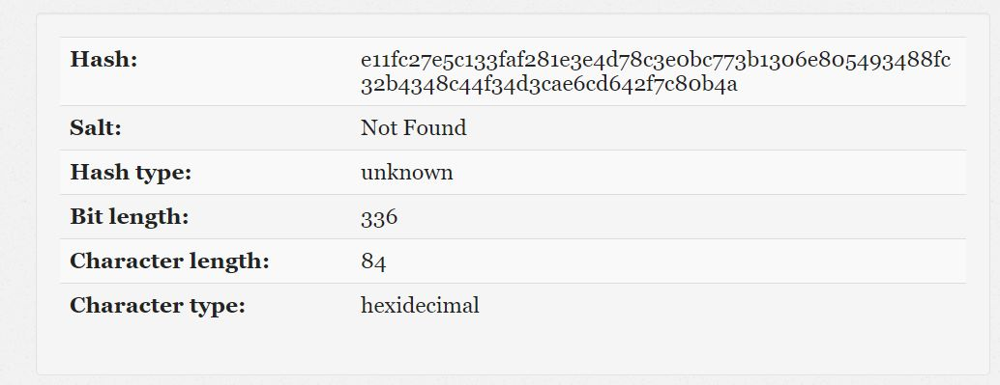
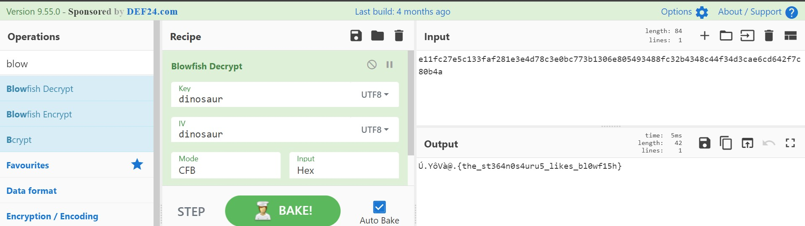

## Forensics - Dinosaur

Pada challange ini kita diberikan sebuah gambar berformat jpg.



dan sebuah deskripsi soal yang menunjukkan beberapa clue untuk mengerjakan soal

```
The stegosaurus is one of the few creatures that likes to eat blowfish. The key of its favorable taste to a blowfish is dinosaur. It initializes his day by using blowfish. Although it wasn't the best food of the prehistoric era, the stegosaurus always leaves a FeedBack which until now, is still a Cipher for historians to crack. No phrases were used by historians to describe the extinct dinosaur.

By the way, stegosaurus likes to hide. Stegosaurus... hide?
```

Pada soal didapatkan beberapa informasi yaitu gambar perlu di `steghide` dengan `tanpa phrases`. Dan menggunakan `cipher blowfish` dengan `dinosaur` sebgai key dan menggunakan `cipher feedback`

Lalu langsung kita steghide gambar tersebut didapatkan txt yang berisi kode.


`e11fc27e5c133faf281e3e4d78c3e0bc773b1306e805493488fc32b4348c44f34d3cae6cd642f7c80b4a`

ternyata data format kode tersebut adalah bentuk hexadecimal



lalu dengan clue yang ada pada deskripsi soal kita lakukan decode dengan `cipher blowfish` dengan `input hex` yang tadi dan menggunakan `mode CFB (cipher FeedBack)` lalu masukan `key nya yaitu dinosaur`



Lalu kita dapatkan flagnya dan kita masukkan ke format flag challange kali ini menjadi
`JCTF2023{the_st364n0s4uru5_likes_bl0wf15h}`
