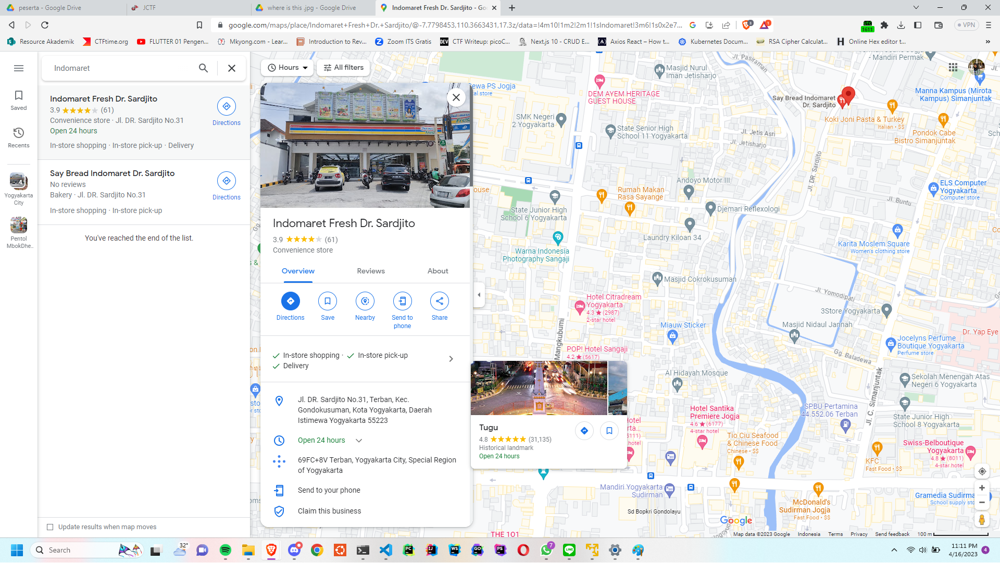

## OSINT - whereIsThis

### Description

> 100pts
> 
> Jota and Krint headed from Tugu Jogja to the north, for some reason Jota and Krint separated, Krint's cellphone ran out of battery and the last photo she sent was a photo of Indomaret version dated January 2022, please help Jota find Indomaret's address to meet Krint. Enter your answer in capital letters using the format JCTF2023{PLUSCODE_KELURAHAN}.
> 
> Author: Jears #8964
>
> https://drive.google.com/file/d/11abiA8bnjYmeM6HHYkJ9-__629EQX7Hs/view?usp=share_link

### Knowledge Requirements

In this challenge we should know how to read Google Maps and retrieve its information (Plus Code and Kelurahan).

### Exploit

In this challenge we were given an image


There is look like an Indomaret store and Pentol Mbokdhe in front of the shop. So let's take a look at the Google Maps and find where is Pentol Mbokdhe located in front of Indomaret.


We get the information, and based on the formad flag, we got that the flag may be JCTF2023{69FC+8V_NGESTIHARJO}. But after submit it the flag was incorrect.

So by read the challenge description, there is a information that **Jota and Krint headed from Tugu Jogja to the north**. Let's find some Indomaret store near Tugu Jogja then we got this store



Submitted this flag JCTF2023{69FC+8V_TERBAN} and we got correct.

### Notes

The Indomaret store and Pentol Mbokdhe was on the same location but in the Google Maps, there is a different address between the Indomaret Store and Pentol Mbokdhe.


### Flag

```
JCTF2023{69FC+8V_TERBAN}
```