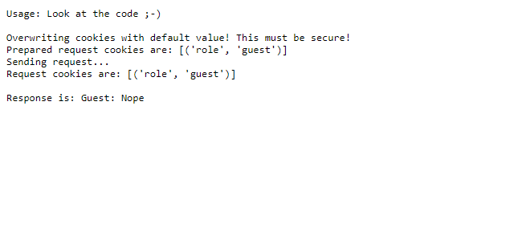
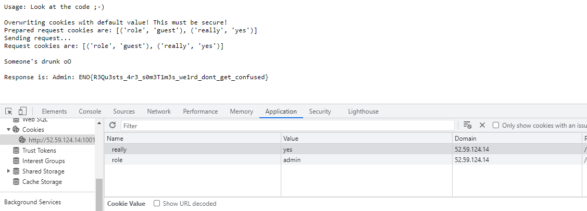

## Web - reguest
> HTTP requests and libraries are hard. Sometimes they do not behave as expected, which might lead to vulnerabilities.

In this challenge, we were given a [source code](code/chall.zip) and when we opened the web there are some information given: <br />
 <br />

I looked at the source code and then at file `backend.py`, I found something interesting if the role was 'admin' and really was 'yes' it would respon with FLAG.
```py
def whoami():
	role = request.cookies.get('role','guest')
	really = request.cookies.get('really', 'no')
	if role == 'admin':
		if really == 'yes':
			resp = 'Admin: ' + os.environ['FLAG']
		else:
			resp = 'Guest: Nope'
	else:
		resp = 'Guest: Nope'
	return Response(resp, mimetype='text/plain')
```

Because the web page mentioned `Overwriting cookies...`, I tried to add cookies value: <br />
 <br />
then refresh the page and got the flag.

So the flag should be:
```
ENO{R3Qu3sts_4r3_s0m3T1m3s_we1rd_dont_get_confused}
```