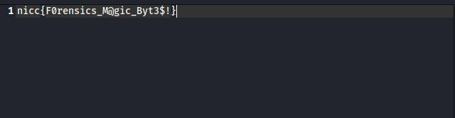

## Forensics - Warped Image
> This image was warped through time and something must have happened to it as we an no longer see it!
> 
> Can you help us so we can see the image?
> 
> Developed by ihanna2

We were given an [image](code/Image2.jpg) with .jpg extension, but when I used `file` command, the output was <br />
. <br />

Next, I tried to use `xxd` command to dump the hex value of the file, and I got <br />
 <br />

Based on the output, the file format should be JFIF, but when I surfing on the internet, JFIF file should started with
```
FF E0 s1 s2 4A 46 49 46 00
```
so I think the header Image was changed, using online [hex editor](https://hex-works.com/eng), I change the first hex value: <br />
 <br /> 

then save it and get a .jpg image <br />
 <br/>

SO the flag should be:
```
nicc{F0rensics_M@gic_Byt3$!}
```