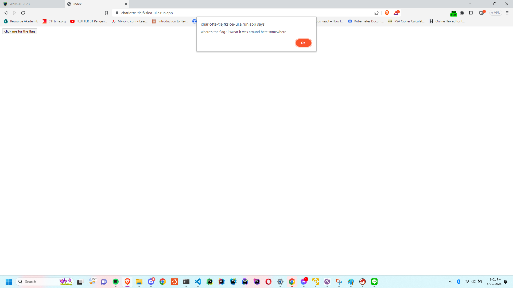
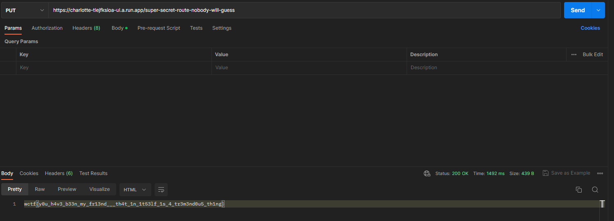

## Beginner - Charlotte's Web

### Description

> Charlotte's Web
> 
> 50
> 
> Web doubledelete#0304
> 
> Welcome to the web!
> 
> https://charlotte-tlejfksioa-ul.a.run.app/

### Exploit

In this challenge we were given a web link to explot. The web is just like this, with a JavaScript allert.


At first, I don't really noticed any information. I opened the page source and got `/src commented`.
```html
<!DOCTYPE html>
<html>
<head>
<title>index</title>
<script>
  function start() {
    alert("where's the flag? i swear it was around here somewhere");
  }
</script>
</head>
<body>
<button onclick='start()'>click me for the flag</button>
<!-- /src -->
</body>
</html>
```

Then, I opened [https://charlotte-tlejfksioa-ul.a.run.app/src](https://charlotte-tlejfksioa-ul.a.run.app/src) and got a flask app code
```py
import flask

app = flask.Flask(__name__)

@app.route('/', methods=['GET'])
def index():
  return flask.send_file('index.html')

@app.route('/src', methods=['GET'])
def source():
  return flask.send_file('app.py')

@app.route('/super-secret-route-nobody-will-guess', methods=['PUT'])
def flag():
  return open('flag').read()
```

The information i got this code is we can send http request `PUT` method on route `/super-secret-route-nobody-will-guess` to open the flag.

Using `Postman`, I send that request and got


Alternatively, we can use this command and got the same result
```sh
curl -X PUT https://charlotte-tlejfksioa-ul.a.run.app/super-secret-route-nobody-will-guess
```

So the flag was
```
wctf{y0u_h4v3_b33n_my_fr13nd___th4t_1n_1t53lf_1s_4_tr3m3nd0u5_th1ng}
```