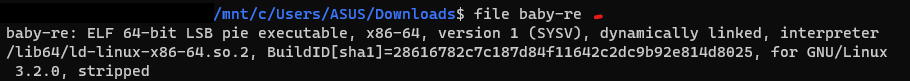
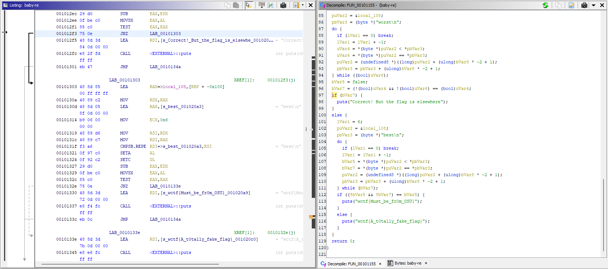
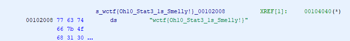

## Beginner - baby-re

### Description

> baby-re
> 
> 50
> 
> Reverse iQlusion#4057
> 
> Just a wee little baby re challenge.

### Exploit

In this challenge, we were given a [file](chall/baby-re). To find out the information of the file, I used the file command and found that the file is  `ELF 64-bit LSB pie executable`.

.

I opened the file using `Ghidra`, then decompile it.


Because at the `FUN_00101155` function it says that the flag would be elsewhere, I scrolled down and got the flag.



So the flag was
```
wctf{Oh10_Stat3_1s_Smelly!}
```