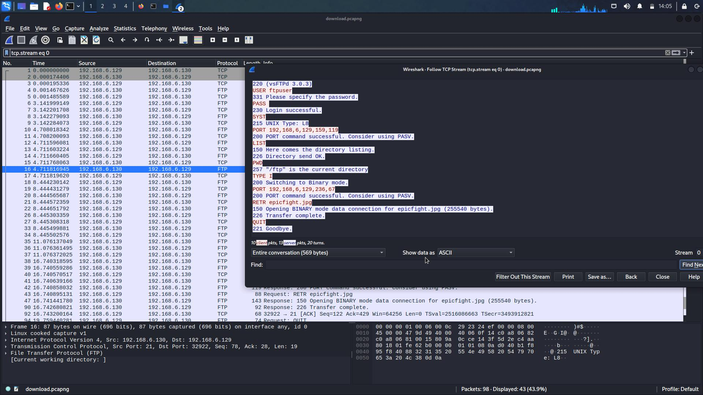
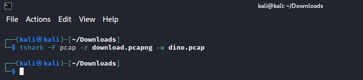
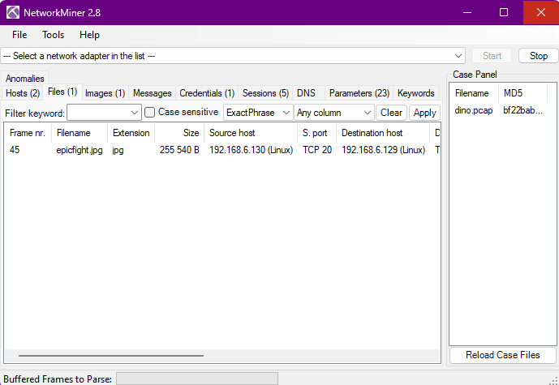
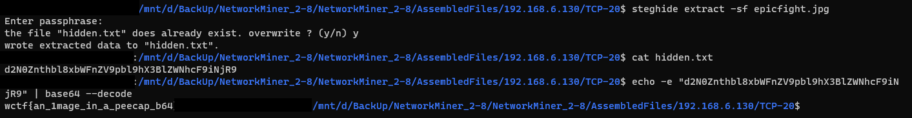

## Forensics - Dino Trading

### Description

> Dino Trading
> 
> 100
> 
> Easy Meep#2331
> 
> I love trading dinosaurs with my friends! I'm sure nobody can see what we're sending, because otherwise, my dinosaurs might get taken.

### Exploit

We were given a [*.pcapng](chall/download.pcapng) file to analyze. I opened the file using Wireshark then I found a packet using FTP protocol. Next, I followed the protocol streams and got some information.



Based on that FTP stream, there was a jpg file was sent via the FTP protocol. Because, I got problem when extracting that file, I convert the `*.pcapng` file to `*.pcap` using tshark.



Then, I opened the flag using Network Miner and got `epicfight.jpg` file.



Last step, I used steganography tools named `steghide` to extract the `*.jpg` file and got the flag.



So, the flag was
```
wctf{an_1mage_in_a_peecap_b64}
```