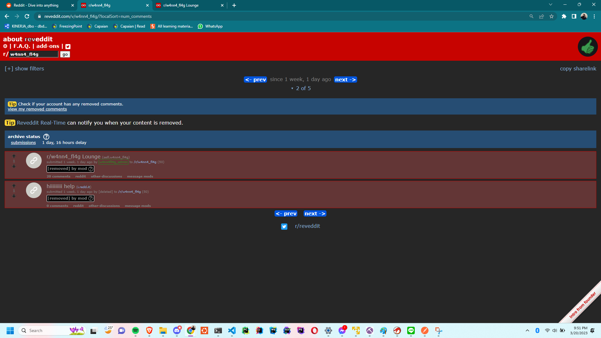
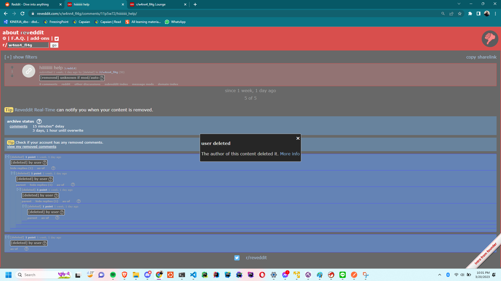

## OSINT - WannaFlag III

### Description

> WannaFlag III: Infiltration
> 
> 318
> 
> dree#0001 Medium
> 
> We have some solid leads so far. However, we need our flags back. Find a way to locate their communication and infiltrate their private ransom service, and submit the stolen flag we wanted to use for the first OSINT!
> 
> From outside intelligence, we know the group sometimes goes by w4nn4_fl4g
> 
> Completion of this Challenge Unlocks:
> 
> WannaFlag IV: Exfiltration
> 
> WannaFlag V: The Mastermind

### Approach

This challenge is sequel from previous [challenge](../OSINT-WannaFlag%20I/README.md). I was so close to found the second flag but unfortunately I can't get it.

In this challenge we were given information about a group named `w4nn4_fl4g`. Using google, I found that the group was `r/w4nn4_fl4g` on Reddit. 


Scrolled the page, there were some comments who deleted by moderators (w4nn4fl4g_admin) and also a user who deleted their account. After 2 hours looking at their group, I found a powerful tools to show removed comment in Reddit named Reveddit.

Using reveddit on this link [https://www.reveddit.com/v/w4nn4_fl4g/](https://www.reveddit.com/v/w4nn4_fl4g/), I can see two archived post


In the first post `r/w4nn4_fl4g Lounge`, I can find nothing. There only a discussion from other participants removed by moderator. The second post was interesting but after I opened the post, the post was removed by moderator and the user who posted was deleted their account so I can't see anything.


Once again, I used another tools named `Unddit`. Based on their website, it can `display removed (by mods) and deleted (by users) comments/posts for Reddit`. So here's the link [https://www.unddit.com/r/w4nn4_fl4g/comments/11p5w72/hiiiiiiiii_help/](https://www.unddit.com/r/w4nn4_fl4g/comments/11p5w72/hiiiiiiiii_help/) and we found


Yeay, let's take a look at the link [https://wanna-flag-d60bf7cd-012a-4fcc-9a4c-e60eca6b653f-tlejfksioa-ul.a.run.app/](https://wanna-flag-d60bf7cd-012a-4fcc-9a4c-e60eca6b653f-tlejfksioa-ul.a.run.app/) and we can found that the flag was

```
wctf{sp1nnnNn_tH3_cUb333e3E}
```
